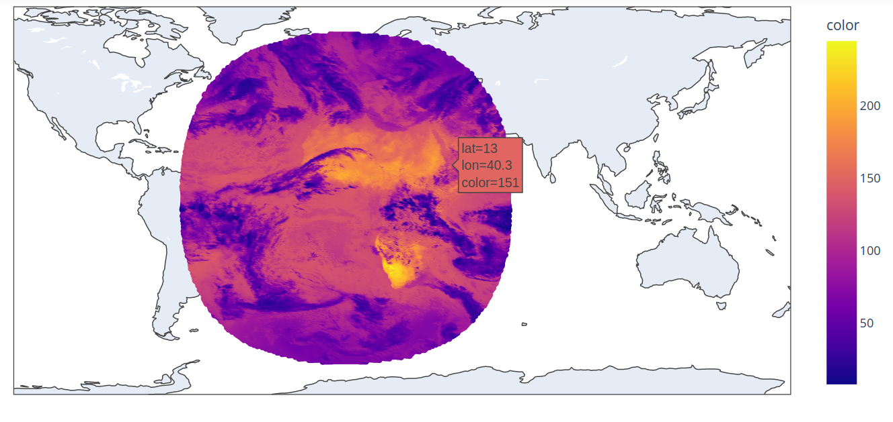

# dxread
## Introduction
This repository is the python version of dxread.c, for reading satellite
DX data. See the example in the `notebooks` folder 
for a sample extraction of the radiance.
See the results folder for sample result images.



The purpose of this code is to allow for easier inspection of data
using python. It is not optimized for performance, nor has it 
been benchmarked.

## Quickstart
To use, just install the library and run the following:
```py3
from dxread.reader import read_dxdata
sat_dat = read_dxdata(filepath)
# Get the pixels from the satellite data
pixels = sat_dat.pixels()
```
where `pixels` is an object of type `dxread.models.dxpixel.DXPixel`.

### Example: Get Infrared Radiance
From the pixels, you can plot various features.
One interesting feature is the infrared radiance:
```py3
lats = [pixel.point.lat for pixel in pixels]
lons = [pixel.point.lon for pixel in pixels]
irads = [pixel.data.dxs1.irad for pixel in pixels]
```
You can use something like plotly express (I highly recommend plotly) to quickly
plot results:
```py3
import plotly.express as px

fig = px.scatter_geo(
    lat=lats,
    lon=lons,
    color=irads,
)
fig.show()
```
which should result in something like this for example:


## References:
+ dxread.c : http://isccp.giss.nasa.gov/pub/tables/ISCCP.DXREADC.0.GLOBAL.2003.09.99.9999.GPC

+ pdf documentation concerning the data structure: http://isccp.giss.nasa.gov/pub/documents/d-doc.pdf
